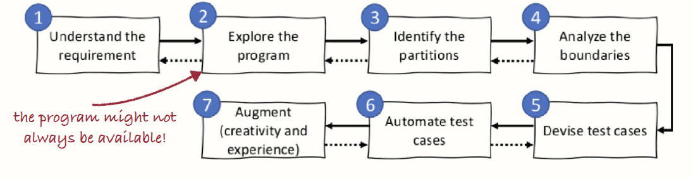

# Exercise #11 - Testing

> [!Important]
> Clone this repository locally.
> 
> Before you start working, go to the `countClumps` subdirectory
> and call `sbt compile` in terminal to download all the needed dependencies.

## 0. Homework questions

**Goal:** Reflect on homework.

0. Is there anything your tutor wants to tell you about previous homework?
1. Do you have any homework-related questions?
2. Have you accepted Homework #10 already?

## 1. Testing guidelines

Go over the following `10` best practices and `5` test smells.

### Best practices

1. Tests should be fast
2. Tests should be cohesive, independent, and isolated
3. Tests should have a reason to exist
4. Tests should be repeatable and not flaky
5. Tests should have strong assertions
6. Tests should break in case the behaviour changes
7. Tests should have a single and clear reason to fail
8. Tests should be easy to write
9. Tests should be easy to read
10. Tests should be easy to change and evolve

### Test smells

1. Excessive duplication
2. Unclear assertions
3. Bad handling of complex or external resources
4. Fixtures that are too general
5. Sensitive assertions

## 2. Unit Testing

1. Open your IDE in the `countClumps` subdirectory.
2. Examine the function `countClumps`. You can find it in `src/main/scala/Clumps.scala`.
    - First, look at its specification and understand it.
    - Then, look at its implementation.
3. Play around with the function `countClumps` using `sbt console`.
    - Prepare an example of using the `countClumps` function.
    - Hint: Here are some examples of values of the type `Array[Int]`:
        - `Array()`
        - `Array(1)`
        - `Array(4, 2)`
        - `Array(1, 2, 3, 2, 1, 1, 1, 2, 3, 4, 1)`
4. Go to `src/test/scala/CountClumpsTests.scala` and observe how tests are written.
5. Run `sbt test` in terminal to run the testing suite.
    - IntelliJ also allows you to click a ▶️  "run tests" button next to the class definition.
6. Make the test fail and run `sbt test` to verify.
7. Comment out the example test.
8. Using the example from step 3, create your own _specification_ (black-box) tests for `countClumps`.
    - Reminder about specification testing:
        - _systematically exploring each input and output variables_ (split into equivalence classes!)
        - explore the boundaries!
        - make sure you only create tests that **matter**
<details>
    <summary>A Design Recipe for writing black-box tests from the lecture</summary>

    

    
</details>

9. Run `sbt test` to verify that your tests work.
10. Now, run `sbt testCoverage` in terminal to generate a _coverage report_.
    - Look at the last line, it should be something like: `[info] All done. Coverage was stmt=[61.54%] branch=[33.33%]` which tells you the _statement coverage_ and the _branch coverage_.
    - Then open `countClumps/out/scoverage-report/index.html` in your browser to see which branches were missed.
11. Moving on to _structural (white-box) testing_: achieve 100% coverage (both statement and branch coverage).
    - You might need your tutor's help for this. :)

## 3. Covering does not mean testing

```scala
test("nothing") {
  val _ = Clumps.countClumps(Array(1, 2, 2, 3, 4))
  assertEquals(true, true)
}
```

Try the following:
1. Comment out all of your existing tests.
2. Copy the test above.
3. Generate a coverage report.
4. Reason about what happened.

## 4. Mutants!

Now that we see that coverage doesn't have to mean a lot,
let us take a look at mutation testing!

1. With only the `"nothing"` test from above, run the `sbt mutate` command to perform _mutation testing_.
2. Reason about the output.
    - Find a line like: `[info] Written HTML report to countClumps/target/stryker4s-report/1673030954426/index.html`
    - Then open that HTML file in your browser and reason about what's there.
3. Remove the `"nothing"` test from above and uncomment your existing tests.
4. Uncomment your tests from part 2.
5. Run the tests and generate a coverage report.
6. Then run the mutation tests and analyze the report.
7. Add more tests / modify existing tests and try to reach 100%.

## 5. Meta tests

This is something which you won't have in the real world,
but for the purposes of this course, we've prepared a suite of "meta tests"
which check if you're actually testing against the specification.
(Remember that your tests should fail if the behaviour changes!)

1. Try running the `sbt meta` command to run the meta tests.
    - There's a _lot_ of output, don't worry about it.
    - Only the last few lines are actually relevant.
2. Now try to add more tests / modify existing tests and try to reach 100%.

## 6. Property tests

1. Open the `sumIntegers` subfolder in your IDE.
2. Examine the function `sumIntegers`. You can find it in `src/main/scala/SumIntegers.scala`.
    - First, look at its specification and understand it.
    - Then, look at its implementation.
3. Play around with the function `sumIntegers` using `sbt console`.
    - Prepare an example of using the `sumIntegers` function.
4. Go to `src/test/scala/SumIntegerTests.scala` and observe how property tests are written.
5. Write a property test which tests that:
    - For all `a: Int` between `0` and `99`
    - For all `b: Int` between `0` and `99`
    - `sumIntegers(a, b)` should be equal to `a + b`
6. Create a generator for _invalid_ numbers.
    - Use `Arbitrary.arbitrary[Int]`.
    - Use the `.filter` method on generators.
7. Write three more property tests to fill the equivalence classes (partitions) of the input/output:
    - a) if `a` is valid and `b` is invalid
    - b) if `a` is invalid and `b` is valid
    - c) if `a` and `b` are both invalid
    - Use the following idiom to catch the exception:
```scala
val _ = intercept[IllegalArgumentException] {
  sumIntegers(a, b)
}
```
8. Run your tests.
9. Create a coverage report, check that you now have 100% coverage.

## 7. Reflection

- Now go back to Part 1 and look again at the best practices and test smells.
- Why is testing important?
- What is the difference between specification-based (black-box) and structural (white-box) testing?
    - Can you come up with a situation where you don't have access to an implementation of the thing you're trying to test?
- How would you unit test in the presence of side effects?
    - Hint: What about `functional core / imperative shell`?
    - What about other kinds of tests? Could you use integration / end-to-end tests for this?

We’ve only done unit tests, commonly used for testing **business logic**.
In real life, you should also perform _integration tests_ to test all of the complex interactions with external services. :)

You should also try test-driven development (write failing tests first, and only afterwards write the code) in your own projects ;)
